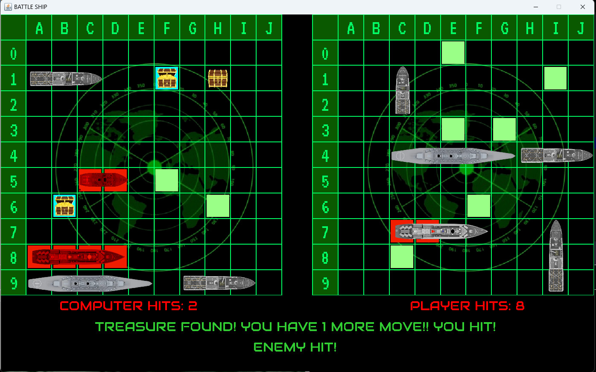

**Created By:**
- [Anh Thu](https://github.com/panadolextra91)
- [Dang Khoi](https://github.com/dangkhoi3107)
- [Nguyen Phat](https://github.com/ititiu21354)
This is a clone of a video game, BattleShip

Made as a part of project in Algorithms & Data Structures course at IU-HCMC.

Uses Java 100% as source code for creating the program

## Contents

```
1.1 Battleship Game Clone Overview
1.2 Introduction
1.3 The Rules of Battleship
1.4 High Level Discussion About Implementation
1.5 How the Core Game Works
```
# 1.2 Introduction

This document will explain the fundamentals of how the Battleship game works.


# 1.3 The Rules of Battleship

Battleship is a strategy game where players try to sink each other's fleet of ships by guessing their locations on a grid. The basic rules are:

-   Each player starts with a 10x10 grid and places 5 ships of varying lengths (5, 4, 3, 3, and 2 units long).
-   Ships can be positioned horizontally or vertically but not diagonally.
-   Players take turns to guess the location of the opponent's ships on the grid.
-   Hits and misses are marked - typically, blue for miss and red for hit.
-   A ship is sunk when all its grid positions are hit.
-   When you hit a treasure, you will have 1 more move.
-   The game ends when all ships of a player are destroyed, and the opponent wins.


# 1.4 High Level Discussion About Implementation

The Battleship game implemented here includes multiple AI levels for single-player experience:

-   Easy AI: Makes random moves without any strategic planning.
-   Medium AI: Uses a mix of random moves and targeted attacks once a ship is hit.
-   Hard AI: Focuses on forming lines of attack and chooses moves based on the highest probability of hitting adjacent cells. The game begins with a difficulty selection dialog, followed by the ship placement phase and then the attack phase where the player targets the enemy grid.


The Easy AI will choose every move entirely randomly. The medium AI will choose random moves unless it has hit a ship that is not yet destroyed. It will attack random adjacent cells to the found hit location until the ship is destroyed. The hard AI will choose moves by considering the number of adjacent cells, and when it finds a ship, it will try to form a line of hit cells instead of choosing adjacent selection randomly.

  

-   Once the game is open the player enters their ship placement phase. You can see in the above three images the progress through placing ships. 
-   In the first image one ship has been placed, and another ship is about to be placed. The ship image indicates the placement is valid. Using the left mouse button to click would place the ship. 
-   The next panel shows the ship being placed onto other ship. This indicates that the placement is not valid because it intersects another existing ship. 
-   Once all ships have been placed the image shown in the last panel will indicate the state has changed to allow attacking of the enemy. The player can then click in the top grid to make attacks.

Clicking on each cell will mark the cell as either a hit or a miss (red or blue respectively). Once a ship
is destroyed it will show the full ship as red behind the red markers. Once all the ships on one grid
have been destroyed either the player will have won, or the computer will have won. This is shown as
seen in the image below on the right.

  

The controls can be summarised as the following.

- At any time:
    o Escape to quit.
    o D to activate debug mode to cheat and view the opponent’s ships.
- During Placement Phase:
    o Click to place ship (only places the ship if it is a valid placement).
    o R to rotate between vertical and horizontal for placement.
    o S to restart the Game and start at placing ships.
- During Attack Phase:
    o Click on the enemy’s grid in places that have not yet been marked to reveal the
       squares as hits or misses.


# 1.5 How the Core Game Works

This section will briefly describe the purpose of each class in the structure. It will not cover in detail all
the methods that are included in each method. You can view the code to browse the in-depth
comments to understand how each element has been created.

Representing the Grid:

- Marker: Represents the coloured red or blue markers that show up when attacking on the grid. All 10x10 of these are created at the start and drawn if they have been marked. They keep track of the ship they would represent hitting to allow the AI to get the information.
- Position: Used to represent a position with an x and y coordinate mostly for indicating the grid coordinates, but in many cases also to represent pixel offsets for drawing.
- Rectangle: Used to represent a generic rectangle with a top corner, width, and height with collision detection against a single point.
- SelectionGrid: The actual grid that contains a collection of markers, ships, and draws these with a set of lines to show where cells are. Includes appropriate methods to manage the state of the grid.
- Ship: Defines a ship that keeps track of where it is located on the grid and should be drawn. The ship can also track whether it has been destroyed to notify other classes when asked.

High level interface:

- Game: Creates the JFrame to contain the GamePanel and manages collection of the keyboard input.
- GamePanel: Controls the two selection grids for the players and manages all the player interaction with their grid. Controls all the information necessary to manage the game state.
- StatusPanel: Represents the text panel at below the two selection grids.

AI:

- BattleshipAI: Defines the template with methods for the other classes to override. This does not do anything useful by itself.
- SimpleRandomAI: Defines the Easy difficulty AI that takes the list of valid moves, randomises the order of the moves, and then selects the first option.
- SmarterAI: Defines the Medium and Hard difficulty AIs. Medium AI is activated by leaving the two parameters false. Hard AI is activated by setting the two parameters to true. You could have difficulties between these two by activating just one of the two parameters. The main thing that the smarter AI does is that it will focus in the area around where it finds a ship hit. The medium AI will just choose random adjacent positions, and otherwise randomly select any valid move. The hard AI with preferMovesFormingLine active will try to form lines with moves once it find a ship hit, this improves the chance of adjacent selections to also be a hit. The hard AI with maximiseAdjacentRandomisation active will change behaviour while selecting moves when there is no recent ship hit. It will search for the valid move with the highest number of unmarked adjacent cells.

